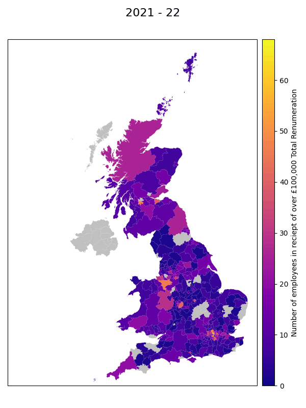
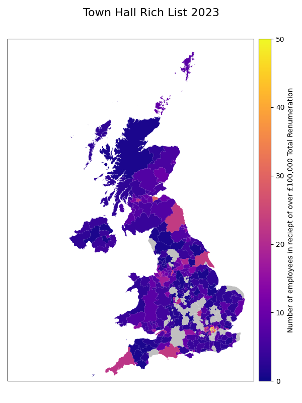

# TownHallRichList

## About

The TownHallRichList is the most comprehensive list of council employees in the UK in receipt of over £100,000 in total remuneration in a single financial year. This has been created for the past 16 years by the TaxPayers' Alliance, a pressure group whose aim is to bring about a low-tax society. With a poor reputation when it comes to [funding transparency](https://www.opendemocracy.net/en/who-funds-you/), the group is often [disparaged](https://www.theguardian.com/politics/2009/oct/09/taxpayers-alliance-conservative-pressure-group) as being affliated with the Conservative party.

Nonetheless, the data appears to be wholly accurate, formed of FOI requests and published data. In the Results section, I present a geospatial visualisation of the data across the past 10 years; this highlights the sheer and growing number of council employees who earn over £100,000. This number being over [3 times](https://www.statista.com/statistics/416139/full-time-annual-salary-in-the-uk-by-region/) larger than an average full-time employee in the UK.

## Results

**Visualisation of data from the Past 10 Years:**



**Map of the 2023 data:**



## Process

First, I downloaded the raw data and stored in the ``data`` folder. Next I process it into an acceptable format and store it as ``.pkl`` in the ``pickles`` folder; the code for this can be found in ``data_clean.ipynb``.

With the processed data we can create maps from it, and sandwich multiple of these maps together to create GIFs. The code for doing this can be seen in ``map_create.ipynb``

## Setup

### Setup the Environment

We use Python 3.8, it should work with different more recent versions as well.

First we need to install [Cartopy](https://scitools.org.uk/cartopy/docs/latest/installing.html)

Create the virtual environment and source it.
Then install the packages required.

```bash
python3 -m venv "thrl_env"
source thrl_env/bin/activate
pip install -r requirements.txt
```

### Get the Shapefiles

The repository doesn't come with them, due to them being large, these can be sourced from [here](https://geoportal.statistics.gov.uk/datasets/ons::local-authority-districts-may-2021-uk-bfe-1/about)

And put them into a folder called ``shapefiles``

## Development stuff

### Update requirements

```bash
pip freeze > requirements.txt
```
